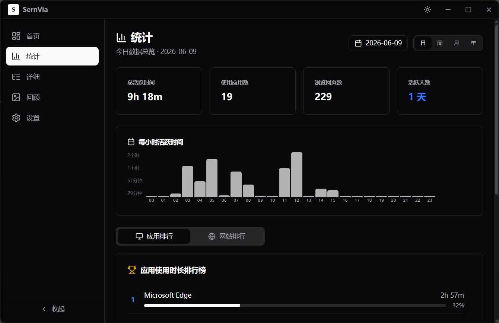

# SernVia - 软件使用统计

<p align="center">
  
</p>

<p align="center">
  <strong>自动追踪 Windows 前台窗口，记录应用和网页使用时长</strong>
</p>

<p align="center">
  
  
  
  
</p>

---

## 📖 简介

SernVia 是一款基于 Tauri v2 构建的 Windows 桌面应用，通过 Windows API 每秒轮询前台窗口信息，自动记录你在各个应用和网站上的使用时长，并以可视化图表呈现。

## ✨ 功能特性

- **📊 自动追踪** — 通过 `GetForegroundWindow` / `GetWindowTextW` / `GetClassNameW` 每秒记录前台活动
- **🌐 浏览器识别** — 自动识别 Chrome、Edge、Firefox、Brave 等浏览器，提取页面标题作为浏览记录
- **📈 数据可视化** — 今日应用排行、本周每日活跃折线图、应用详情时段分析（使用 recharts）
- **🖥️ 系统托盘** — 右键菜单：显示窗口 / 隐藏到托盘 / 退出
- **🔒 关闭到托盘** — 点击关闭按钮自动隐藏到托盘，后台持续监控
- **🚀 开机自启** — 支持开机自启动，自启时自动隐藏到托盘（设置页面可开关）
- **🎨 应用图标** — 自动从 exe 文件提取应用图标并缓存
- **🗃️ 数据管理** — 支持更改存储路径、导出 JSON、清除数据
- **📦 数据压缩** — 使用 gzip 压缩存档，节省磁盘空间

## 🖼️ 截图



## 🛠️ 技术栈

| 层级 | 技术 |
|------|------|
| **前端框架** | React 19 + TypeScript |
| **UI 组件** | shadcn/ui (Radix UI + Tailwind CSS v4) |
| **图表** | Recharts |
| **路由** | React Router v7 |
| **桌面框架** | Tauri v2 (Rust) |
| **系统 API** | Windows API (windows-rs 0.58) |
| **数据存储** | JSON + gzip (flate2) |

## 📁 项目结构

```
SernVia/
├── src/                        # 前端源码
│   ├── App.tsx                 # 路由配置
│   ├── main.tsx                # 入口文件
│   ├── types.ts                # TypeScript 类型
│   ├── pages/
│   │   ├── HomePage.tsx        # 首页（概览、趋势图）
│   │   ├── StatsPage.tsx       # 统计排行
│   │   ├── DetailsPage.tsx     # 详细记录
│   │   ├── SettingsPage.tsx    # 设置页面
│   │   └── Layout.tsx          # 侧边栏布局
│   ├── components/
│   │   ├── ui/                 # shadcn/ui 组件
│   │   ├── Sidebar.tsx
│   │   ├── AppUsageList.tsx
│   │   └── ...
│   └── lib/
│       ├── format.ts           # 时间格式化
│       └── utils.ts            # 工具函数
├── src-tauri/                  # Rust 后端
│   ├── src/
│   │   ├── lib.rs              # 主入口，Tauri 配置，系统托盘
│   │   ├── main.rs             # 程序入口
│   │   ├── monitor.rs          # 活动追踪器，数据模型
│   │   └── windows_api.rs      # Windows API 封装
│   ├── icons/                  # 应用图标
│   ├── capabilities/           # 权限配置
│   └── tauri.conf.json         # Tauri 配置文件
└── package.json
```

## 🚀 快速开始

### 前置要求

- [Node.js](https://nodejs.org/) >= 18
- [pnpm](https://pnpm.io/)
- [Rust](https://www.rust-lang.org/) (通过 [rustup](https://rustup.rs/) 安装)
- Windows 10/11（仅支持 Windows，因使用了 Win32 API）

### 安装 & 运行

```bash
# 1. 安装前端依赖
pnpm install

# 2. 开发模式运行（热更新）
pnpm tauri dev
```

### 构建发布

```bash
pnpm tauri build
```

构建产物位于 `src-tauri/target/release/bundle/`：
- `nsis/sernvia_*.exe` — NSIS 安装包（中文界面）
- `msi/sernvia_*.msi` — MSI 安装包

## ⚙️ 路由

| 路径 | 页面 | 说明 |
|------|------|------|
| `/` | 首页 | 概览、当前活动、今日排行、本周趋势折线图 |
| `/stats` | 统计 | 应用使用排行、网站浏览排行 |
| `/details` | 详细 | 应用列表、网站列表，带搜索功能 |
| `/settings` | 设置 | 开机自启开关、数据路径管理、导出/清除数据 |

## 📄 许可证

[MIT](LICENSE)
